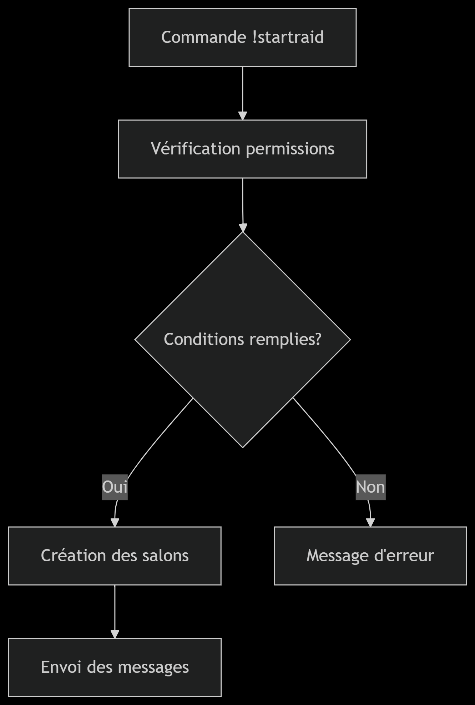

# 🔥 RaidBot - Système de Gestion de Raid Discord

*« Un outil technique pour explorer l'API Discord - À utiliser avec responsabilité »*

<div align="center">
</div>

## 📌 Table des Matières
- [✨ Fonctionnalités](#-fonctionnalités)
- [🎯 Cas d'Usage Technique](#-cas-dusage-technique)
- [🚀 Installation](#-installation)
- [⚙️ Configuration](#️-configuration)
- [📜 Commandes](#-commandes)
- [⚠️ Avertissement Légal](#-avertissement-légal)

## ℹ️ Ce projet est conçu **uniquement pour :

- L'éducation aux API Discord

- La recherche en sécurité

- Le développement de contre-mesures

## ✨ Fonctionnalités 
<b> Automatisation : </b> Création dynamique de salons/textes

<b>Contrôle : </b> Système de pause/reprise en temps réel via les commandes ?pause ?resume

<b>Nettoyage : </b> Suppression automatisée des traces via ?unraid

## 🎯 Cas d'Usage Technique



## 🚀 Installation

- Python 3.10 +
- compte <a href = "https://discord.com/developers">discord developpers</a>

<b>Étapes : </b>

Cloner le dépôt

git clone https://github.com/votrecompte/raidbot.git

cd raidbot

 Installer les dépendances

pip install -r requirements.txt

## ⚙️ Configuration 

- À la ligne "84", remplacer "YOUR_TOKEN" par votre token discord 

## 📜 Commandes

- *?startraid*   permet de commencé le raid

- *?unraid* permet d'annulé le raid et de rétablir les anciens salons,... 

- *?pause* permet de mettre en pause le raid

- *?resume* permet de continuer le raid après le *?pause*

## ⚠️ Avertissement Légal
```diff
! L'utilisation abusive de ce bot peut entraîner :
+ La suspension de votre compte Discord
+ Des restrictions d'API permanentes
+ Des conséquences légales dans certaines juridictions 
